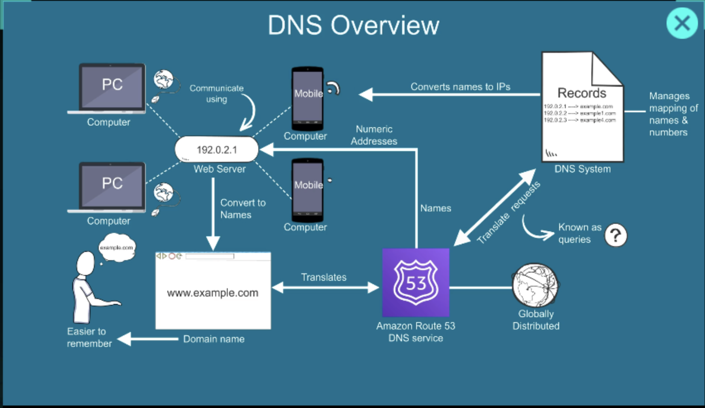
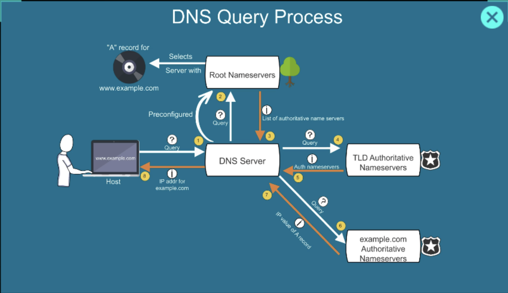

# AWS DNS and Route 53

DNS (Domain Name System) translates human-readable domain names into IP addresses that servers use to communicate.

Example:

```
User types: www.example.com
DNS resolves: 93.184.216.34
Browser connects to: 93.184.216.34
```



---

## Why DNS Exists

Servers communicate using IP addresses, not names. Humans remember names, not IPs. DNS bridges the gap.

Without DNS, you would need to memorize `93.184.216.34` instead of `www.example.com`.

---

## How DNS Resolution Works



When you type a domain in a browser:

1. **Browser cache** — checks if it already knows the IP
2. **OS cache** — checks the local system resolver
3. **Recursive Resolver** — your ISP's DNS server takes over if no cache hit
4. **Root Name Server** — directs the resolver to the correct TLD server (e.g., `.com`)
5. **TLD Name Server** — directs the resolver to the authoritative name server for the domain
6. **Authoritative Name Server** — returns the actual IP address
7. **Response returned** — browser connects to the IP

```
Browser
   ↓
Recursive Resolver (ISP)
   ↓
Root Name Server
   ↓
TLD Name Server (.com)
   ↓
Authoritative Name Server (example.com)
   ↓
IP Address → back to browser
```

---

## DNS Record Types

| Record | Purpose                                   | Example                        |
| ------ | ----------------------------------------- | ------------------------------ |
| A      | Maps domain to IPv4 address               | `example.com → 93.184.216.34` |
| AAAA   | Maps domain to IPv6 address               | `example.com → 2606:2800:...` |
| CNAME  | Alias from one domain to another          | `www → example.com`           |
| MX     | Mail server for the domain                | `mail.example.com`            |
| TXT    | Arbitrary text (used for verification)    | SPF, DKIM, domain ownership   |
| NS     | Authoritative name servers for the domain | `ns1.awsdns-01.com`           |
| SOA    | Start of Authority — zone metadata        | Serial, refresh, TTL defaults |

---

## AWS Route 53

**Amazon Route 53** is AWS's managed DNS service. It handles:

* Domain registration
* DNS routing
* Health checks and failover

### Routing Policies

| Policy            | Behavior                                                |
| ----------------- | ------------------------------------------------------- |
| Simple            | Single record, returns one value                        |
| Weighted          | Split traffic by percentage (e.g., 80/20 A/B deploy)   |
| Latency-based     | Routes to the AWS region with lowest latency            |
| Failover          | Primary/secondary — switches on health check failure    |
| Geolocation       | Routes based on the user's geographic location          |
| Multivalue Answer | Returns multiple IPs, acts like basic load balancing    |

### Health Checks

Route 53 can monitor endpoints and automatically stop routing traffic to unhealthy ones. Combined with Failover routing, it enables high availability without manual intervention.

---

## TTL: Time to Live

TTL controls how long DNS resolvers cache a record before re-querying.

* Short TTL (60s) — changes propagate quickly, but more DNS queries
* Long TTL (86400s = 1 day) — fewer queries, but changes are slow to propagate

When migrating a domain or changing IPs, lower the TTL before making the change.

---

## Private DNS with Route 53

Route 53 also supports **private hosted zones** — DNS that only resolves within a VPC.

Use case: internal service discovery where services call each other by name (`auth.internal`) instead of hardcoded IPs.

```
EC2 (app)
   ↓
Route 53 private zone: auth.internal
   ↓
EC2 (auth service)
```
---

← [Previous: Security Groups & NACLs](./security-groups-nacl.md) | [Home](../../README.md) | [Next: CloudFront →](./cloudfront.md)
