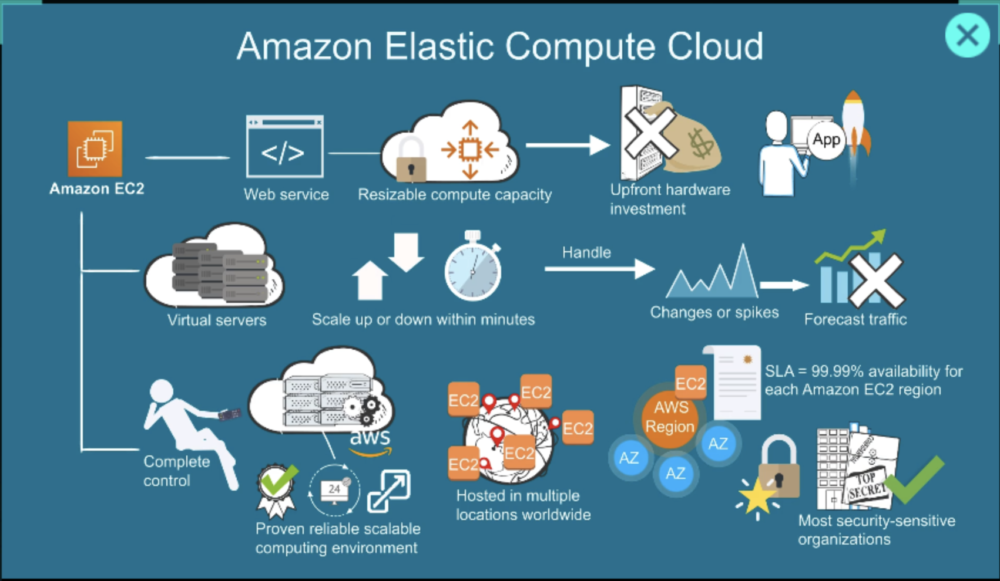
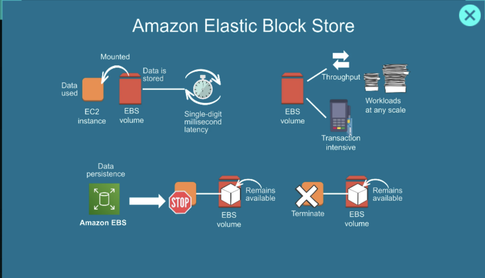
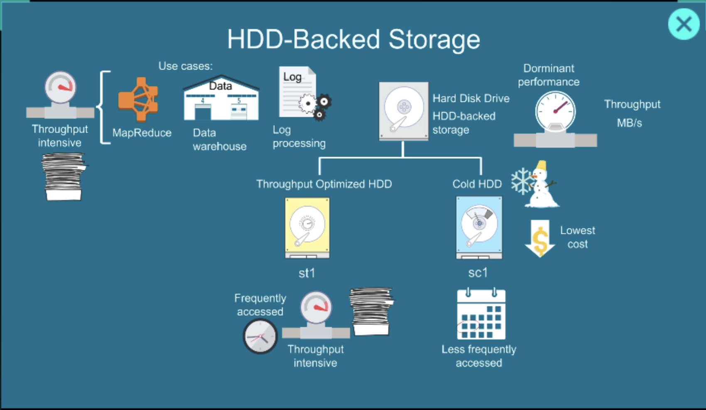

← [Previous: AWS Compute](./README.md) | [Home](../../README.md) | [Next: AMI & Launch Templates →](./ami-launch-templates.md)

---

# AWS EC2: Elastic Compute Cloud

Amazon EC2 (Elastic Compute Cloud) provides **virtual servers in the cloud**. Instead of buying a physical machine, you rent a server from AWS and run your applications on it.



## What is EC2?

Think of EC2 as a computer running in an AWS data center.

You can:

* Install Linux or Windows
* Run websites and APIs
* Host databases (though RDS is usually preferred)
* Run Docker containers
* Deploy FastAPI, Django, Node.js, etc.

```
Your Laptop
    ↓
Internet
    ↓
AWS EC2 Server
    ↓
Application
```

## EC2 Architecture

```
AWS Account
    ↓
VPC
    ↓
Subnet
    ↓
EC2 Instance
    ↓
EBS Volume
```

Every EC2 instance runs inside a VPC (Virtual Private Cloud).

---

## EC2 Components

### AMI: Amazon Machine Image

An AMI is a pre-configured template used to launch an instance. It defines the OS and base software.

Examples:

```
Ubuntu
Amazon Linux
Red Hat
Windows Server
```


You can also create your own AMI from a running instance — useful for backups and scaling.

---

### Instance Types

Instance types determine CPU, RAM, and network performance. You pick one when launching an EC2.

| Instance  | vCPU | Use Case         |
| --------- | ---- | ---------------- |
| t3.micro  | 2    | Small apps       |
| t3.small  | 2    | Development      |
| t3.medium | 2    | Medium workloads |
| c7g.large | More | Compute-heavy    |
| r7g.large | More | Memory-heavy     |


---

### EBS: Elastic Block Store

Amazon EBS is a **persistent block storage** service attached to EC2 instances — like an SSD or HDD for your virtual server.

Stores:

* OS
* Application code
* Logs and data






Key properties:

* Data persists even when the instance is stopped
* Can be detached and reattached to another instance
* Snapshots can be taken for backup or migration

---

### Security Groups

A security group acts as a **virtual firewall** for an EC2 instance, controlling inbound and outbound traffic.

Example rules:

| Port | Protocol | Purpose  |
| ---- | -------- | -------- |
| 22   | TCP      | SSH      |
| 80   | TCP      | HTTP     |
| 443  | TCP      | HTTPS    |
| 8000 | TCP      | FastAPI  |

If a port is not open in the security group, traffic to that port is blocked.

---

### Key Pair

Used for SSH access to the instance.

```bash
ssh -i mykey.pem ubuntu@<public-ip>
```

The `.pem` private key file must be kept secure — AWS only provides it once on creation.

---

## Launch Flow

```
AMI
 ↓
Instance Type
 ↓
Storage (EBS)
 ↓
Security Group
 ↓
Key Pair
 ↓
Launch EC2
```

---

## Networking

### Public IP vs Private IP

| Type       | Accessible From |
| ---------- | --------------- |
| Public IP  | Internet        |
| Private IP | Inside VPC only |

Example:

* Public: `13.x.x.x`
* Private: `172.31.x.x`

Note: Public IPs assigned by default are **ephemeral** — they change on stop/start. Use an **Elastic IP** for a fixed address.

---

## Pricing Models

### On-Demand

Pay per second/hour with no commitment.

Best for: development, testing, unpredictable workloads.

### Reserved Instances

Commit for 1 or 3 years in exchange for up to 75% discount.

Best for: stable, predictable workloads.

### Spot Instances

Use spare AWS capacity at up to 90% discount. AWS can terminate your instance with 2 minutes' notice.

Best for: batch jobs, CI/CD pipelines, fault-tolerant workloads.

---

## Example: Deploy a FastAPI App

1. Launch Ubuntu EC2 with ports 22, 80, 443 open in security group
2. SSH into the server:

```bash
ssh -i key.pem ubuntu@server-ip
```

3. Install Python:

```bash
sudo apt update && sudo apt install python3-pip -y
```

4. Run FastAPI:

```bash
uvicorn app:app --host 0.0.0.0 --port 8000
```

5. Access from browser:

```
http://server-ip:8000/docs
```

---

## Real-World Architecture

```
Users
   ↓
Load Balancer (ALB)
   ↓
EC2 (FastAPI)
   ↓
RDS (PostgreSQL)
   ↓
S3 (Files/Images)
```

---

## Key Operations

| Operation          | Effect                             |
| ------------------ | ---------------------------------- |
| Start Instance     | Boot the virtual server            |
| Stop Instance      | Shutdown (EBS data persists)       |
| Reboot Instance    | Restart without terminating        |
| Terminate Instance | Permanently delete the server      |
| Create AMI         | Snapshot for backup or replication |
| Attach IAM Role    | Grant AWS service permissions      |
| Attach EBS Volume  | Add or expand disk storage         |
---

← [Previous: AWS Compute](./README.md) | [Home](../../README.md) | [Next: AMI & Launch Templates →](./ami-launch-templates.md)
