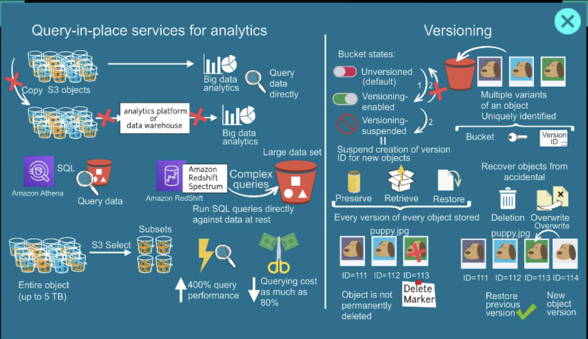
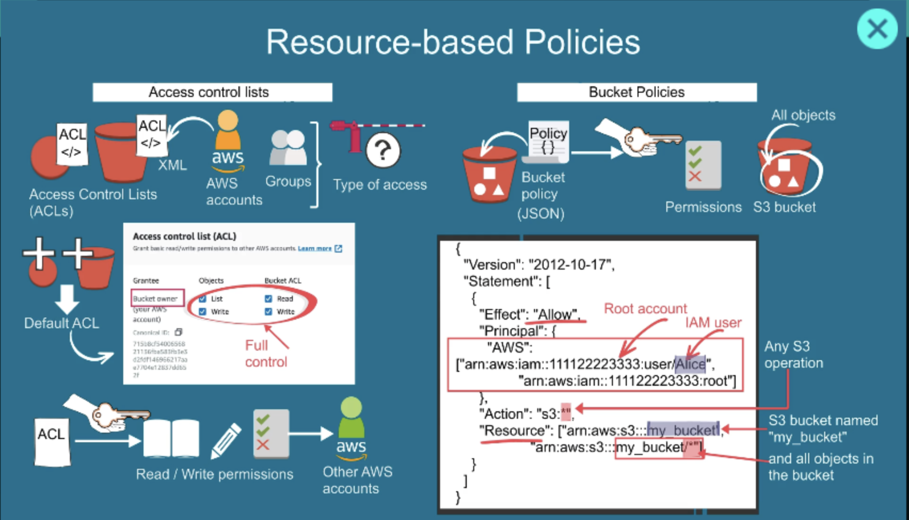
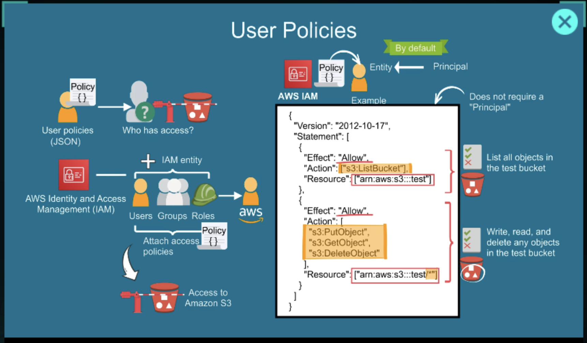

← [Previous: AWS Storage](./README.md) | [Home](../../README.md) | [Next: EBS →](./ebs.md)

---

# AWS S3: Simple Storage Service

**Amazon S3 (Simple Storage Service)** is one of the core storage services in AWS. It lets you store and retrieve any amount of data from anywhere over the internet.


## What S3 Actually Is

Think of S3 like a **highly durable online file storage system**.

* You upload files → AWS stores them
* You download files → anytime, from anywhere
* You don't manage servers at all

In AWS terms:

* Files = **Objects**
* Folders = **Buckets**

## How It Works

```
Bucket (like a folder)
   ├── image.jpg (object)
   ├── video.mp4 (object)
   └── data.json (object)
```

You create a **bucket**, then upload **objects** inside it.

## Key Features


### 1. Unlimited Storage

You can store virtually **unlimited data**.

### 2. High Durability

AWS promises **99.999999999% durability** (11 nines). Your data is automatically replicated across multiple systems.

### 3. Access Control

You control who can access files using:

* IAM policies
* Bucket policies
* Public/private access settings

### 4. Pay Only for Usage

You pay for:

* Storage used
* Data transfer
* Requests

### 5. Different Storage Classes

You can optimize cost:

| Class                | Use case                           |
| -------------------- | ---------------------------------- |
| Standard             | Frequently accessed data           |
| Intelligent-Tiering  | Auto cost optimization             |
| Glacier              | Archival (very cheap, slow access) |
| Glacier Deep Archive | Long-term backup                   |

## Common Use Cases

People use S3 for:

* Storing images/videos for websites
* Backups and disaster recovery
* Hosting static websites
* Data lakes for analytics
* Logs and application data

## Important Concepts

* **Bucket name must be globally unique**
* **Objects can be up to 5TB**
* You access objects via URLs

Example:

```
https://your-bucket-name.s3.amazonaws.com/image.jpg
```

## Quick Example (AWS CLI)

Upload a file:

```bash
aws s3 cp file.txt s3://my-bucket/
```

Download a file:

```bash
aws s3 cp s3://my-bucket/file.txt .
```

---

## Storage Classes

Amazon S3 storage classes are **different pricing + performance tiers** for storing your data, depending on how often you access it and how quickly you need it.


### Core Idea

* Frequently used data → faster but expensive
* Rarely used data → cheaper but slower
* Archive data → very cheap but takes time to retrieve

### Main S3 Storage Classes

#### 1. S3 Standard (default)

* For frequently accessed data
* Low latency, high throughput
* Stored across multiple AZs

**Use case:** Websites, apps, APIs, active data

---

#### 2. S3 Intelligent-Tiering

* Automatically moves data between tiers
* Best when access pattern is unknown

**Use case:** Unpredictable usage (logs, user uploads). AWS optimizes cost automatically.

---

#### 3. S3 Standard-IA (Infrequent Access)

* Lower cost than Standard
* Charges apply when you access data
* Still fast retrieval

**Use case:** Backups, disaster recovery files

---

#### 4. S3 One Zone-IA

* Stored in only one AZ (cheaper)
* Risk of data loss if AZ fails

**Use case:** Re-creatable data, temporary backups

---

#### 5. S3 Glacier (Archive)

* Very low cost
* Retrieval takes minutes to hours

**Use case:** Old backups, compliance data

---

#### 6. S3 Glacier Deep Archive

* Cheapest storage option
* Retrieval takes hours or more

**Use case:** Data you almost never access, legal/financial archives

---

### Quick Comparison

| Storage Class       | Cost       | Speed         | Best for          |
| ------------------- | ---------- | ------------- | ----------------- |
| Standard            | High       | Instant       | Active data       |
| Intelligent-Tiering | Medium     | Instant       | Unknown usage     |
| Standard-IA         | Lower      | Instant       | Rare access       |
| One Zone-IA         | Even lower | Instant       | Non-critical data |
| Glacier             | Very low   | Minutes–hours | Archive           |
| Deep Archive        | Lowest     | Hours         | Long-term storage |

### Simple Way to Choose

* Not sure? → **Intelligent-Tiering**
* Daily usage? → **Standard**
* Backup? → **Standard-IA**
* Archive? → **Glacier / Deep Archive**

---

## Management Tools for Data Control


## Data Analytics and Versioning



### Versioning

S3 Versioning keeps **multiple versions of the same object** in a bucket. When enabled:

* Every upload of the same key creates a new version instead of overwriting
* Deleted objects get a **delete marker** — they are not permanently removed
* Previous versions can be restored at any time

```
bucket/image.jpg
  ├── version-id: abc123  ← current
  ├── version-id: def456  ← previous
  └── version-id: ghi789  ← oldest
```

Use versioning when:

* You need protection from accidental overwrites or deletions
* You maintain config files or application artifacts that change over time
* Compliance requires retaining all historical versions

Cost note: all versions count toward storage billing. Use **lifecycle policies** to expire old versions automatically.

---

### S3 Analytics

**S3 Storage Class Analysis** monitors access patterns and recommends when to transition objects to a cheaper storage class.

Example: if S3 Standard objects are rarely accessed after 30 days, the analysis will suggest moving them to Standard-IA.

Configure it per bucket or per prefix/tag.

---

### Lifecycle Policies

Lifecycle rules automate transitions and expiration without manual intervention.

Example rule:

```
After 30 days  → Move to Standard-IA
After 90 days  → Move to Glacier
After 365 days → Delete permanently
```

Useful for:

* Log files
* Temporary uploads
* Old database backups

---

## Access Management


Access management in AWS is primarily handled by **AWS Identity and Access Management (IAM)**.

### What is IAM?

IAM controls:

* **Who** can access AWS resources
* **What** actions they can perform
* **Which** resources they can access

### IAM Components

#### 1. Users

Individual identities for people or applications.

A user can have:

* Password (AWS Console login)
* Access Keys (CLI/API access)

---

#### 2. Groups

A collection of users with similar permissions.

Example groups:

* Developers
* QA Team
* Administrators

Instead of assigning permissions to each user, assign them to a group.

---

#### 3. Policies

Policies define permissions using JSON.

Example policy allowing S3 read access:

```json
{
  "Version": "2012-10-17",
  "Statement": [
    {
      "Effect": "Allow",
      "Action": [
        "s3:GetObject"
      ],
      "Resource": "*"
    }
  ]
}
```

Policies answer:

* Allow or Deny?
* Which actions?
* On which resources?

---

#### 4. Roles

Roles provide temporary permissions.

Common examples:

* EC2 accessing S3
* Lambda accessing DynamoDB
* Cross-account access

Instead of storing credentials in code, AWS services assume roles.

---

### Authentication vs Authorization

| Concept        | Meaning          |
| -------------- | ---------------- |
| Authentication | Who are you?     |
| Authorization  | What can you do? |



---

← [Previous: AWS Storage](./README.md) | [Home](../../README.md) | [Next: EBS →](./ebs.md)
