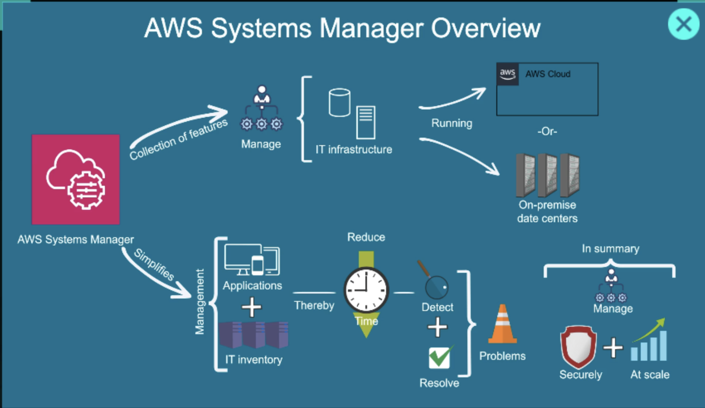
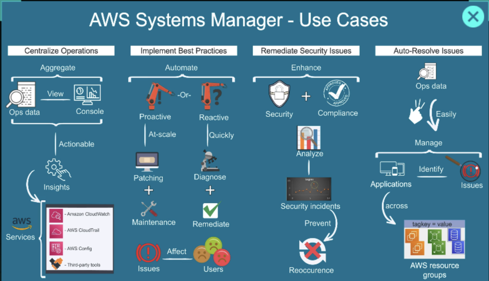

# AWS Systems Manager

AWS Systems Manager (SSM) is a management service that gives you visibility and control over your AWS infrastructure. It lets you automate operational tasks across EC2 instances and other AWS resources — without needing to SSH into each server manually.



---

## What Problem It Solves

Managing a fleet of EC2 instances manually is error-prone and time-consuming:

* Running commands on 50 servers one by one
* Keeping OS patches up to date
* Tracking which software is installed where
* Securely storing database passwords and API keys

Systems Manager automates and centralizes all of this.

---

## Key Features


### 1. Session Manager

Provides a secure browser-based or CLI shell session to EC2 instances **without opening port 22 or using SSH keys**.

Benefits:

* No inbound ports required
* All sessions are logged to CloudWatch or S3
* Works through IAM permissions

```bash
# Connect via AWS CLI (no key pair needed)
aws ssm start-session --target i-0123456789abcdef0
```

---

### 2. Run Command

Execute shell scripts or AWS-provided documents across multiple instances simultaneously.

Example: restart Nginx on 20 servers at once:

```bash
aws ssm send-command \
  --document-name "AWS-RunShellScript" \
  --targets "Key=tag:env,Values=production" \
  --parameters '{"commands":["sudo systemctl restart nginx"]}'
```

Output is captured and returned per instance.

---

### 3. Patch Manager

Automates the process of patching OS and software.

* Define a **Patch Baseline** — which patches to approve
* Define a **Maintenance Window** — when patching runs
* Report on patch compliance across your fleet

Supports Amazon Linux, Ubuntu, RHEL, Windows Server.

---

### 4. Parameter Store

A secure, hierarchical store for configuration data and secrets.

| Type         | Use                                              |
| ------------ | ------------------------------------------------ |
| String       | Plain config values (e.g., region name)          |
| StringList   | Comma-separated values                           |
| SecureString | Encrypted values using KMS (passwords, API keys) |

Example: store a database password

```bash
aws ssm put-parameter \
  --name "/prod/db/password" \
  --value "supersecret" \
  --type SecureString
```

Retrieve in application code without hardcoding secrets.

---

### 5. Inventory

Automatically collects metadata from managed instances:

* Installed applications
* Running services
* OS configuration
* Network settings

Stored in Systems Manager and queryable for compliance audits.

---

### 6. State Manager

Ensures instances maintain a **desired state** over time.

Example: ensure the CloudWatch agent is always installed and running. If it drifts, State Manager re-applies the configuration automatically.

---

## Use Cases



| Scenario                           | SSM Feature      |
| ---------------------------------- | ---------------- |
| SSH without port 22                | Session Manager  |
| Run a script on 100 servers        | Run Command      |
| Keep OS patches current            | Patch Manager    |
| Store DB passwords securely        | Parameter Store  |
| Audit what's installed on servers  | Inventory        |
| Enforce a config across fleet      | State Manager    |

---

## How Instances Connect to SSM

EC2 instances need:

1. **SSM Agent** installed — pre-installed on Amazon Linux 2, Ubuntu 20.04+, Windows Server
2. **IAM Role** with the `AmazonSSMManagedInstanceCore` policy attached
3. Network access to SSM endpoints (via public internet or VPC endpoints)

No inbound security group rules are required for any SSM functionality.

---

## Parameter Store vs Secrets Manager

Both store secrets, but they differ:

| Feature              | Parameter Store      | Secrets Manager          |
| -------------------- | -------------------- | ------------------------ |
| Cost                 | Free (standard tier) | Paid per secret          |
| Auto rotation        | Manual               | Built-in rotation        |
| Cross-account access | Limited              | Native support           |
| Best for             | Config + secrets     | Database credentials     |

Use Parameter Store for most configs. Use Secrets Manager when you need automatic rotation (e.g., RDS passwords).
