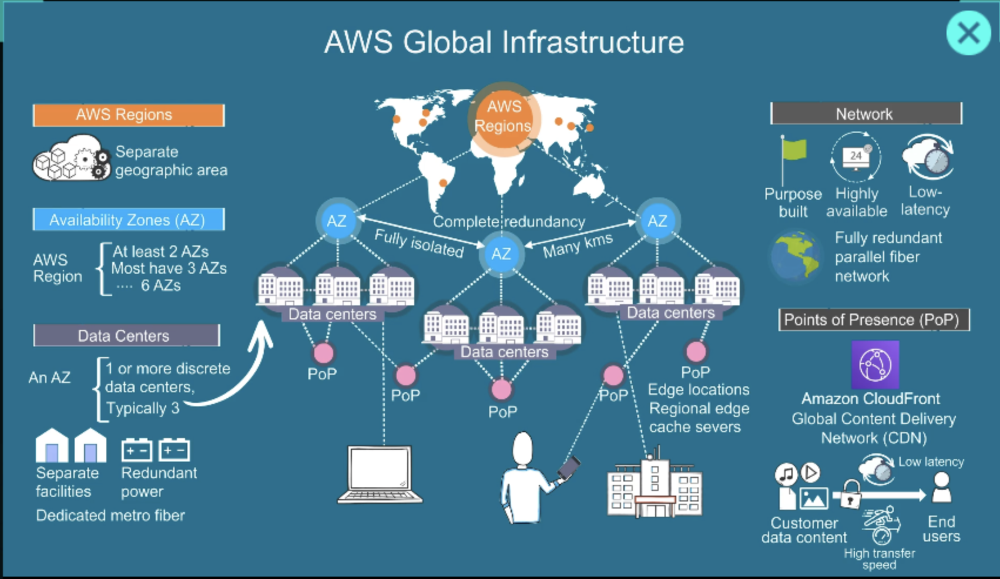
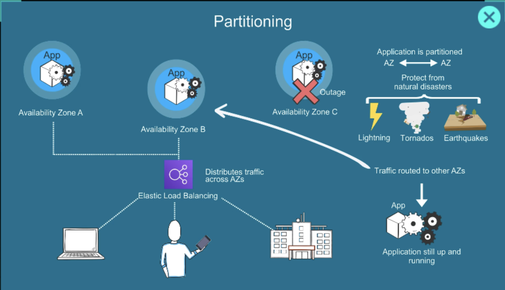
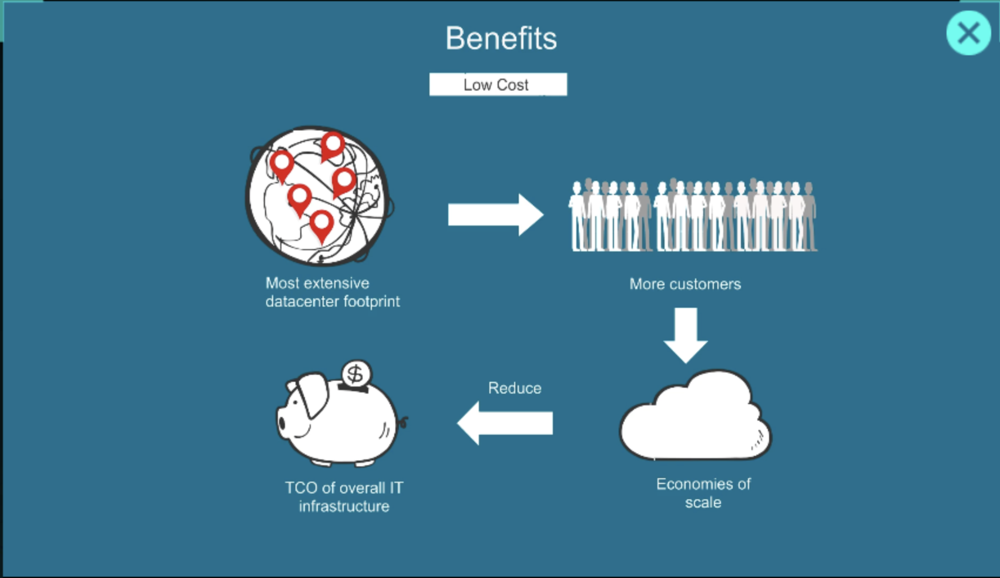
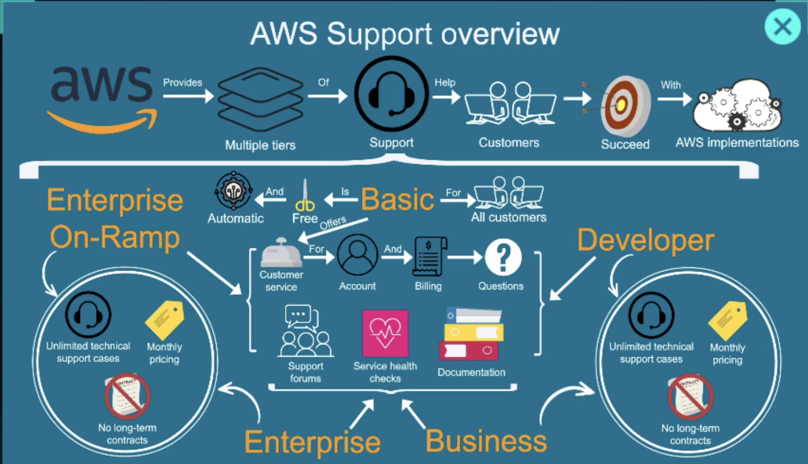

# AWS — Amazon Web Services

AWS (Amazon Web Services) is a cloud computing platform provided by Amazon. It lets individuals and companies rent computing resources over the internet instead of buying and maintaining physical servers.





---

## What AWS Provides

AWS offers hundreds of cloud services, including:

| Category | Services | Examples |
|----------|----------|---------|
| Compute | Virtual servers, serverless | EC2, Lambda |
| Storage | Object, block, file storage | S3, EBS, EFS |
| Databases | SQL and NoSQL | RDS, DynamoDB |
| Networking | Routing, DNS, CDN | VPC, Route 53, CloudFront |
| AI / ML | Model building and inference | SageMaker, Bedrock |
| Security | Identity, encryption | IAM, KMS |

---

## Why Companies Use AWS




- Scalability — grow or shrink instantly
- Reliability — redundant global infrastructure
- Pay-as-you-go pricing — no upfront hardware cost
- Security and compliance tools
- Faster deployment cycles

---

## Support and Documentation




---

## Section Index

| Section | Topics |
|---------|--------|
| [01-account-setup](./01-account-setup/README.md) | Account creation, billing, AWS CLI |
| [02-iam](./02-iam/README.md) | Users, groups, roles, policies, organizations |
| [03-networking](./03-networking/README.md) | VPC, subnets, Route 53, CloudFront |
| [04-compute](./04-compute/README.md) | EC2, AMIs, Auto Scaling, Lambda |
| [05-storage](./05-storage/README.md) | S3, EBS, EFS, FSx |
| [06-databases](./06-databases/README.md) | RDS, Aurora, DynamoDB, ElastiCache |
| [07-containers](./07-containers/README.md) | ECS, EKS, ECR |
| [08-serverless](./08-serverless/README.md) | Lambda, API Gateway, SQS, SNS |
| [09-security](./09-security/README.md) | KMS, Secrets Manager, GuardDuty, WAF |
| [10-observability](./10-observability/README.md) | CloudWatch, CloudTrail, Config |
| [11-management](./11-management/README.md) | Systems Manager |
| [12-cicd](./12-cicd/README.md) | CodeBuild, CodeDeploy, CodePipeline |
| [13-iac](./13-iac/README.md) | CloudFormation, CDK, Terraform on AWS |
| [14-projects](./14-projects/README.md) | Hands-on projects |

---

## Common Use Case: 3-Tier Web App

```
Users
  ↓
CloudFront (CDN)
  ↓
ALB (Load Balancer)
  ↓
EC2 / Lambda (Application)
  ↓
RDS / DynamoDB (Database)
  ↓
S3 (File Storage)
```

Major organizations using AWS: Netflix, Airbnb, NASA, Samsung, Twitch.
