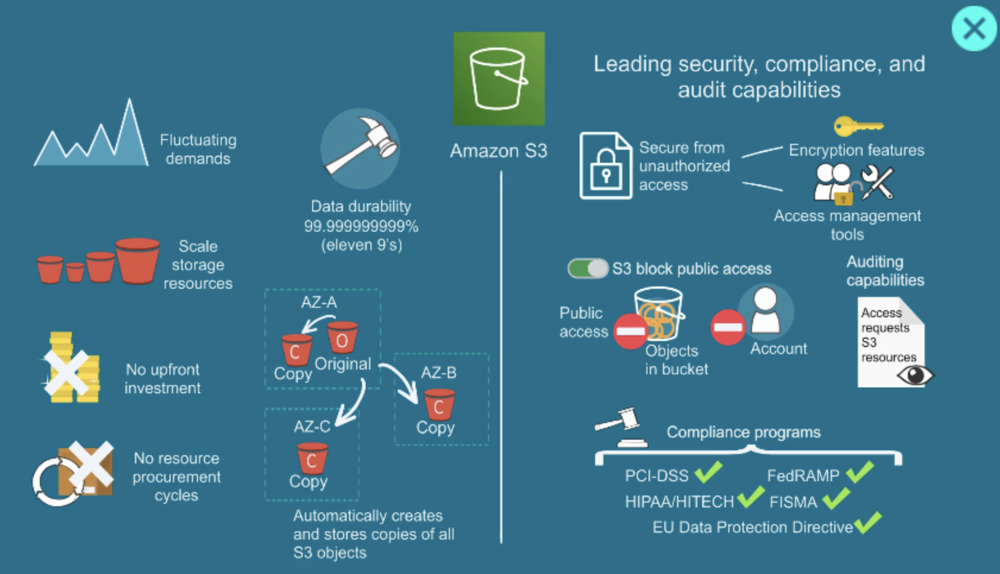

# AWS-Learnings

# What is AWS?

AWS stands for Amazon Web Services, a cloud computing platform provided by Amazon.

It lets individuals and companies rent computing resources over the internet instead of buying and maintaining physical servers.

## What AWS provides

AWS offers hundreds of cloud services, including:

* **Compute** – virtual servers and app hosting
  Example: EC2, Lambda

* **Storage** – store files, backups, and databases
  Example: S3, EBS

* **Databases** – managed SQL and NoSQL databases
  Example: RDS, DynamoDB

* **Networking** – routing, DNS, content delivery
  Example: VPC, Route 53, CloudFront

* **AI & Machine Learning** – build and deploy AI models
  Example: SageMaker, Bedrock

* **Security** – identity management and encryption
  Example: IAM, KMS

## Simple analogy

Instead of buying:

* servers,
* networking hardware,
* storage devices,
* and data centers,

you “rent” them from AWS and pay only for what you use.

It’s similar to:

* using electricity from a utility company instead of running your own power plant.

## Why companies use AWS

Businesses use AWS because it offers:

* Scalability (grow or shrink instantly)
* Reliability
* Global infrastructure
* Pay-as-you-go pricing
* Security and compliance tools
* Faster deployment

## Common AWS services

Here are a few well-known services:

| Service    | Purpose                        |
| ---------- | ------------------------------ |
| EC2        | Virtual servers                |
| S3         | File/object storage            |
| Lambda     | Run code without servers       |
| RDS        | Managed relational databases   |
| CloudFront | CDN/content delivery           |
| IAM        | Access control and permissions |

## Who uses AWS?

Many major organizations use AWS, including startups, enterprises, governments, and streaming platforms.

Examples include:

* Netflix
* Airbnb
* NASA
* Samsung
* Twitch

## Example use case

A company building a website might use:

* **EC2** to run the website
* **RDS** for the database
* **S3** to store images
* **CloudFront** to deliver content globally


# AWS S3: Simple Storage Service

**Amazon S3 (Simple Storage Service)** is one of the core storage services in AWS. It lets you store and retrieve any amount of data from anywhere over the internet.


## What S3 actually is

Think of S3 like a **highly durable online file storage system**.

* You upload files → AWS stores them
* You download files → anytime, from anywhere
* You don’t manage servers at all

In AWS terms:

* Files = **Objects**
* Folders = **Buckets**

## How it works (simple)

```
Bucket (like a folder)
   ├── image.jpg (object)
   ├── video.mp4 (object)
   └── data.json (object)
```

You create a **bucket**, then upload **objects** inside it.

## Key features



### 1. Unlimited storage

You can store virtually **unlimited data**.

### 2. High durability

AWS promises **99.999999999% durability** (11 nines).
Your data is automatically replicated across multiple systems.

### 3. Access control

You control who can access files using:

* IAM policies
* Bucket policies
* Public/private access settings

### 4. Pay only for usage

You pay for:

* Storage used
* Data transfer
* Requests

### 5. Different storage classes

You can optimize cost:

| Class                | Use case                           |
| -------------------- | ---------------------------------- |
| Standard             | Frequently accessed data           |
| Intelligent-Tiering  | Auto cost optimization             |
| Glacier              | Archival (very cheap, slow access) |
| Glacier Deep Archive | Long-term backup                   |

## Common use cases

People use S3 for:

* Storing images/videos for websites
* Backups and disaster recovery
* Hosting static websites
* Data lakes for analytics
* Logs and application data

## Example

If you're building a web app:

* Upload user profile images → S3
* Store PDFs or documents → S3
* Backup database → S3

## Real-world analogy

S3 is like:

* **Google Drive**, but for developers
* **Dropbox**, but scalable for companies

## Important concepts

* **Bucket name must be globally unique**
* **Objects can be up to 5TB**
* You access objects via URLs

Example:

```
https://your-bucket-name.s3.amazonaws.com/image.jpg
```

## Quick example (AWS CLI)

Upload a file:

```bash
aws s3 cp file.txt s3://my-bucket/
```

Download a file:

```bash
aws s3 cp s3://my-bucket/file.txt .
```
