# AWS-Learnings

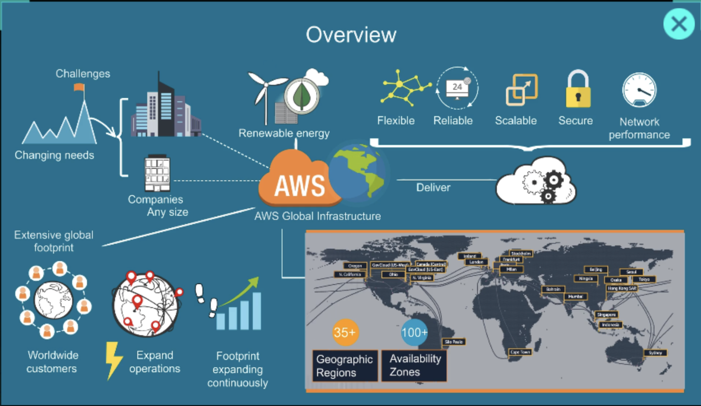


# What is AWS?

AWS stands for Amazon Web Services, a cloud computing platform provided by Amazon.

It lets individuals and companies rent computing resources over the internet instead of buying and maintaining physical servers.

## What AWS provides

AWS offers hundreds of cloud services, including:

* **Compute** – virtual servers and app hosting
  Example: EC2, Lambda

* **Storage** – store files, backups, and databases
  Example: S3, EBS

* **Databases** – managed SQL and NoSQL databases
  Example: RDS, DynamoDB

* **Networking** – routing, DNS, content delivery
  Example: VPC, Route 53, CloudFront

* **AI & Machine Learning** – build and deploy AI models
  Example: SageMaker, Bedrock

* **Security** – identity management and encryption
  Example: IAM, KMS

## Simple analogy

Instead of buying:

* servers,
* networking hardware,
* storage devices,
* and data centers,

you “rent” them from AWS and pay only for what you use.

It’s similar to:

* using electricity from a utility company instead of running your own power plant.

## Why companies use AWS

Businesses use AWS because it offers:

* Scalability (grow or shrink instantly)
* Reliability
* Global infrastructure
* Pay-as-you-go pricing
* Security and compliance tools
* Faster deployment

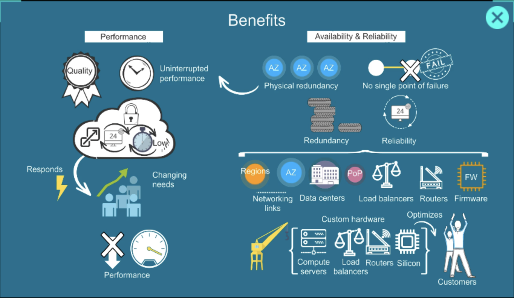
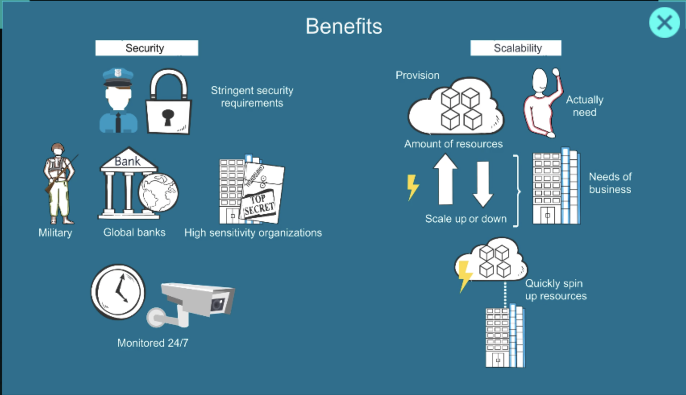


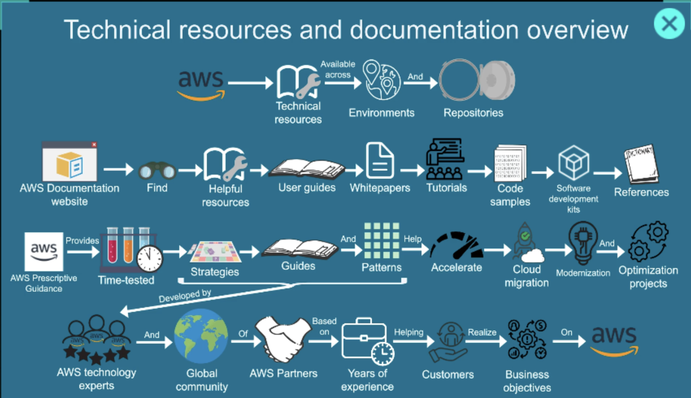
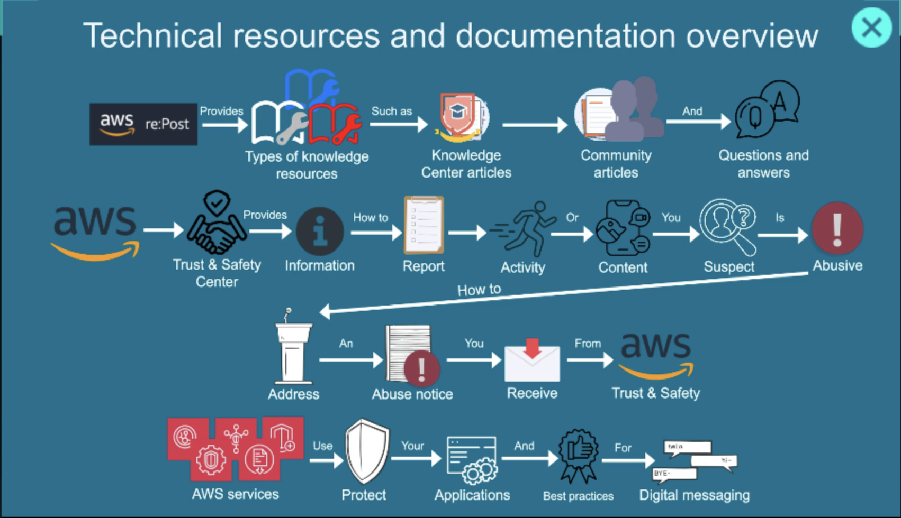
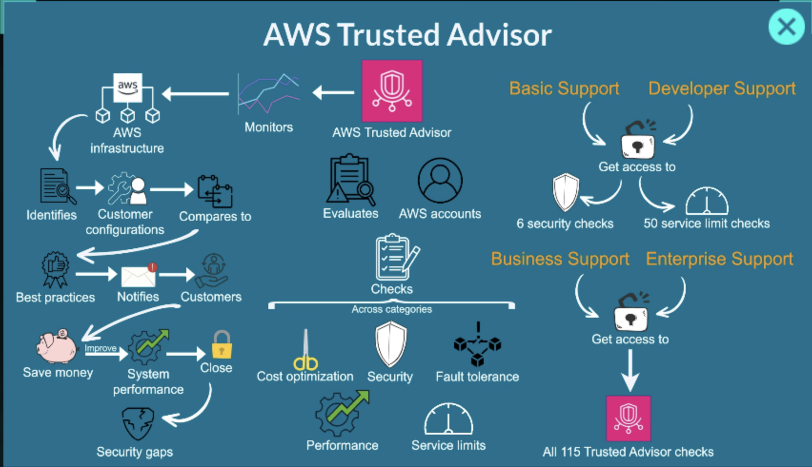


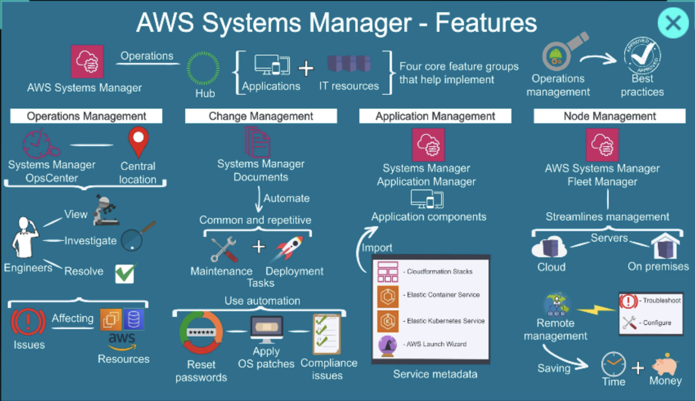


## Common AWS services

Here are a few well-known services:

| Service    | Purpose                        |
| ---------- | ------------------------------ |
| EC2        | Virtual servers                |
| S3         | File/object storage            |
| Lambda     | Run code without servers       |
| RDS        | Managed relational databases   |
| CloudFront | CDN/content delivery           |
| IAM        | Access control and permissions |

## Who uses AWS?

Many major organizations use AWS, including startups, enterprises, governments, and streaming platforms.

Examples include:

* Netflix
* Airbnb
* NASA
* Samsung
* Twitch

## Example use case

A company building a website might use:

* **EC2** to run the website
* **RDS** for the database
* **S3** to store images
* **CloudFront** to deliver content globally


# AWS S3: Simple Storage Service

**Amazon S3 (Simple Storage Service)** is one of the core storage services in AWS. It lets you store and retrieve any amount of data from anywhere over the internet.

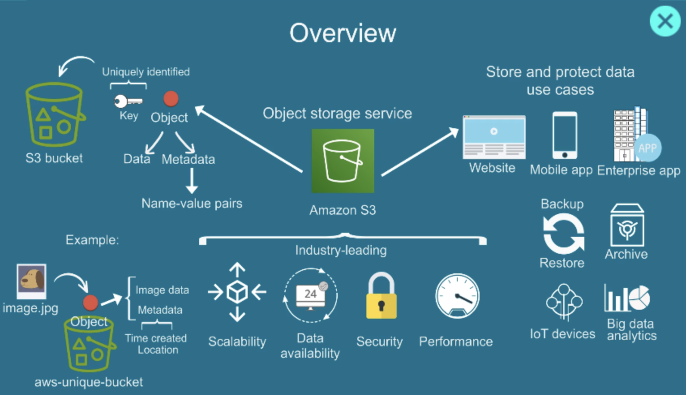


## What S3 actually is

Think of S3 like a **highly durable online file storage system**.

* You upload files → AWS stores them
* You download files → anytime, from anywhere
* You don’t manage servers at all

In AWS terms:

* Files = **Objects**
* Folders = **Buckets**

## How it works (simple)

```
Bucket (like a folder)
   ├── image.jpg (object)
   ├── video.mp4 (object)
   └── data.json (object)
```

You create a **bucket**, then upload **objects** inside it.

## Key features


### 1. Unlimited storage

You can store virtually **unlimited data**.

### 2. High durability

AWS promises **99.999999999% durability** (11 nines).
Your data is automatically replicated across multiple systems.

### 3. Access control

You control who can access files using:

* IAM policies
* Bucket policies
* Public/private access settings

### 4. Pay only for usage

You pay for:

* Storage used
* Data transfer
* Requests

### 5. Different storage classes

You can optimize cost:

| Class                | Use case                           |
| -------------------- | ---------------------------------- |
| Standard             | Frequently accessed data           |
| Intelligent-Tiering  | Auto cost optimization             |
| Glacier              | Archival (very cheap, slow access) |
| Glacier Deep Archive | Long-term backup                   |

## Common use cases

People use S3 for:

* Storing images/videos for websites
* Backups and disaster recovery
* Hosting static websites
* Data lakes for analytics
* Logs and application data

## Example

If you're building a web app:

* Upload user profile images → S3
* Store PDFs or documents → S3
* Backup database → S3

## Real-world analogy

S3 is like:

* **Google Drive**, but for developers
* **Dropbox**, but scalable for companies

## Important concepts

* **Bucket name must be globally unique**
* **Objects can be up to 5TB**
* You access objects via URLs

Example:

```
https://your-bucket-name.s3.amazonaws.com/image.jpg
```

## Quick example (AWS CLI)

Upload a file:

```bash
aws s3 cp file.txt s3://my-bucket/
```

Download a file:

```bash
aws s3 cp s3://my-bucket/file.txt .
```

## Storage Classes

Amazon S3 storage classes are basically **different pricing + performance tiers** for storing your data, depending on how often you access it and how quickly you need it.

Instead of using one type of storage for everything, AWS lets you optimize cost by choosing the right class.

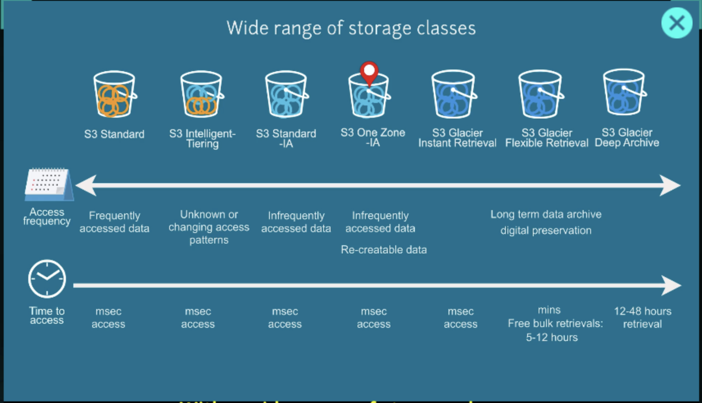

---

### Core idea

* Frequently used data → faster but expensive
* Rarely used data → cheaper but slower
* Archive data → very cheap but takes time to retrieve

---

### Main S3 storage classes

#### 1. S3 Standard (default)


* For frequently accessed data
* Low latency, high throughput
* Stored across multiple AZs

**Use case:**

* Websites
* Apps
* APIs
* Active data

---

#### 2. S3 Intelligent-Tiering


* Automatically moves data between tiers
* Best when access pattern is unknown

**Use case:**

* Unpredictable usage (logs, user uploads)

👉 You don’t need to think much—AWS optimizes cost for you.

---

#### 3. S3 Standard-IA (Infrequent Access)


* Lower cost than Standard
* But charges when you access data
* Still fast retrieval

**Use case:**

* Backups
* Disaster recovery files

---

#### 4. S3 One Zone-IA


* Stored in only one AZ (cheaper)
* Risk of data loss if AZ fails

**Use case:**

* Re-creatable data
* Temporary backups

---

#### 5. S3 Glacier (Archive)


* Very low cost
* Retrieval takes minutes to hours

**Use case:**

* Old backups
* Compliance data

---

#### 6. S3 Glacier Deep Archive


* Cheapest storage option
* Retrieval takes hours (or more)

**Use case:**

* Data you almost never access
* Legal/financial archives

---

### Quick comparison

| Storage Class       | Cost       | Speed         | Best for          |
| ------------------- | ---------- | ------------- | ----------------- |
| Standard            | High       | Instant       | Active data       |
| Intelligent-Tiering | Medium     | Instant       | Unknown usage     |
| Standard-IA         | Lower      | Instant       | Rare access       |
| One Zone-IA         | Even lower | Instant       | Non-critical data |
| Glacier             | Very low   | Minutes–hours | Archive           |
| Deep Archive        | Lowest     | Hours         | Long-term storage |

---

### Simple way to choose

* Not sure? → **Intelligent-Tiering**
* Daily usage? → **Standard**
* Backup? → **Standard-IA**
* Archive? → **Glacier / Deep Archive**

---

### Real-world example (your project)

For something like your platform:

* User profile images → Standard
* Old invoices → Standard-IA
* Logs older than 3 months → Glacier
* 1+ year old data → Deep Archive

### Management Tools for data control

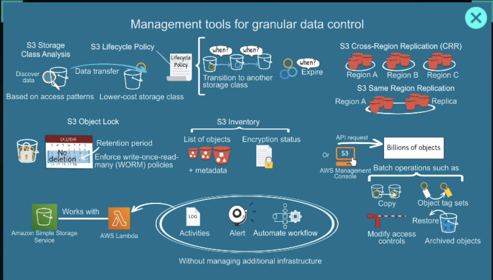

### Data analytics and versioning


## Access Management
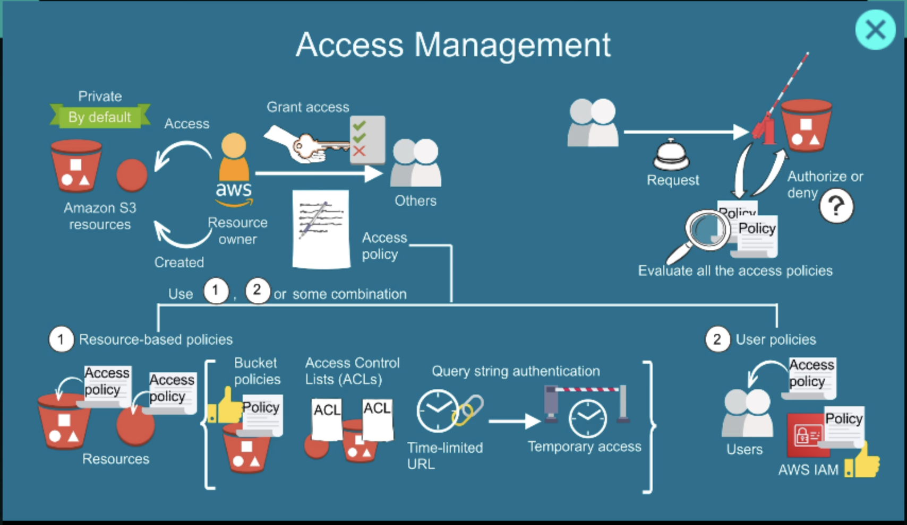

**Access Management**, which in AWS is primarily handled by AWS Identity and Access Management (IAM).

### What is IAM?

IAM controls:

* **Who** can access AWS resources
* **What** actions they can perform
* **Which** resources they can access

Think of IAM as the security guard of your AWS account.

---

### IAM Components

#### 1. Users

Individual identities for people or applications.

Example:

* Jay
* Developer1
* AdminUser

A user can have:

* Password (AWS Console login)
* Access Keys (CLI/API access)

---

#### 2. Groups

A collection of users with similar permissions.

Example:

* Developers
* QA Team
* Administrators

Instead of assigning permissions to each user, assign them to a group.

---

#### 3. Policies

Policies define permissions using JSON.

Example policy allowing S3 read access:

```json
{
  "Version": "2012-10-17",
  "Statement": [
    {
      "Effect": "Allow",
      "Action": [
        "s3:GetObject"
      ],
      "Resource": "*"
    }
  ]
}
```

Policies answer:

* Allow or Deny?
* Which actions?
* On which resources?

---

#### 4. Roles

Roles provide temporary permissions.

Common examples:

* EC2 accessing S3
* Lambda accessing DynamoDB
* Cross-account access

Instead of storing credentials in code, AWS services assume roles.

---

### Authentication vs Authorization

| Concept        | Meaning          |
| -------------- | ---------------- |
| Authentication | Who are you?     |
| Authorization  | What can you do? |

Example:

* Login using username/password → Authentication
* Allowed to delete an S3 bucket → Authorization


# AWS EC2: Elastic Compute Cloud

Amazon EC2 (Elastic Compute Cloud) is a service that provides virtual servers in the AWS cloud.

EC2 provides **virtual servers in the cloud**. Instead of buying a physical machine, you rent a server from AWS and run your applications on it.


## What is EC2?

Think of EC2 as a computer running in an AWS data center.

You can:

* Install Linux or Windows
* Run websites and APIs
* Host databases (though RDS is usually preferred)
* Run Docker containers
* Deploy FastAPI, Django, Node.js, etc.

EC2 allows you to:
- Run Linux or Windows servers
- Host websites
- Deploy APIs
- Run Docker containers
- Execute batch jobs
- Perform development and testing

Example:
```txt
Your Laptop
    ↓
Internet
    ↓
AWS EC2 Server
    ↓
Application
```

## EC2 Architecture
```txt
AWS Account
    ↓
VPC
    ↓
Subnet
    ↓
EC2 Instance
    ↓
EBS Volume
```

Every EC2 instance runs inside a VPC.

## EC2 Components

AWS EC2, is built using different components


### EC2 AMI (Amazon Machine Image)

An AMI is a template used to launch instances. It is like a template for your server.

Examples:
```txt
Ubuntu
Amazon Linux
Red Hat
Windows Server
```

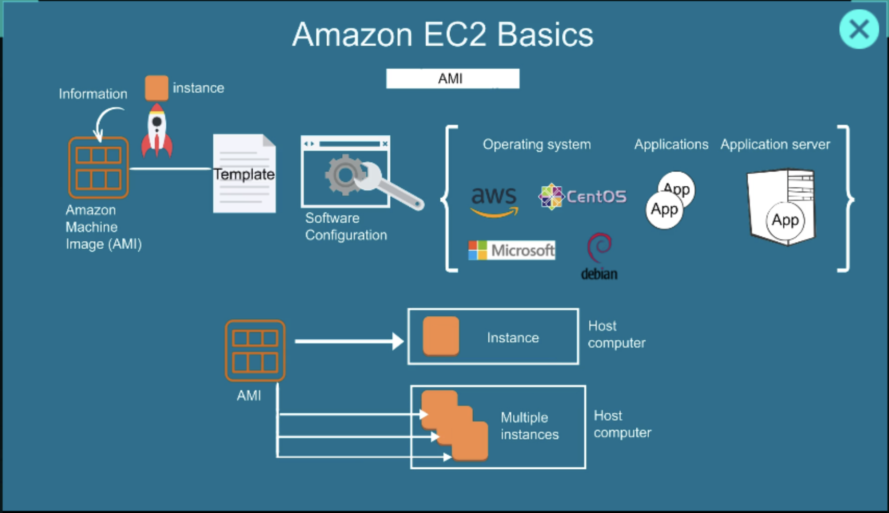

### EC2 instance

We can create aws EC2 instances i.e. virtual system as per our requirement.

Determines CPU, RAM, and performance.

Examples:

| Instance  | vCPU     | Use Case         |
| --------- | -------- | ---------------- |
| t3.micro  | 2        | Small apps       |
| t3.small  | 2        | Development      |
| t3.medium | 2        | Medium workloads |
| c7g.large | More CPU | Compute-heavy    |
| r7g.large | More RAM | Memory-heavy     |

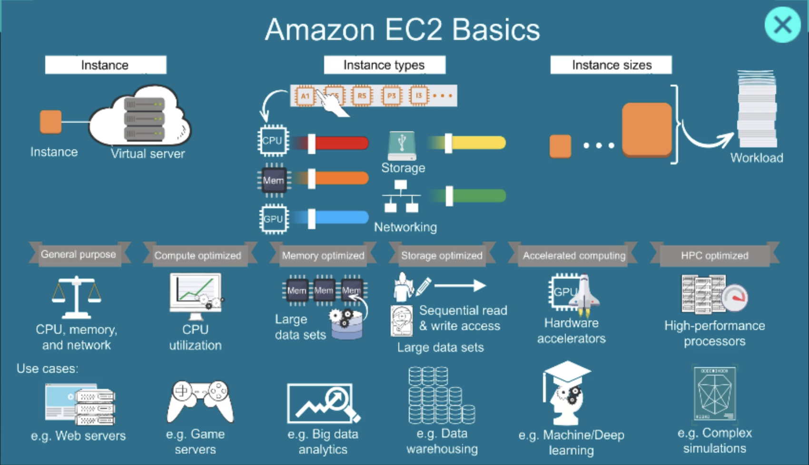

### EBS: Elastic Block Store

Amazon Elastic Block Store (EBS) is a persistent block storage service used with EC2 instances.

Your EC2 disk storage.
Like:
* SSD/HDD attached to a computer

Stores:
* OS
* Application code
* Logs

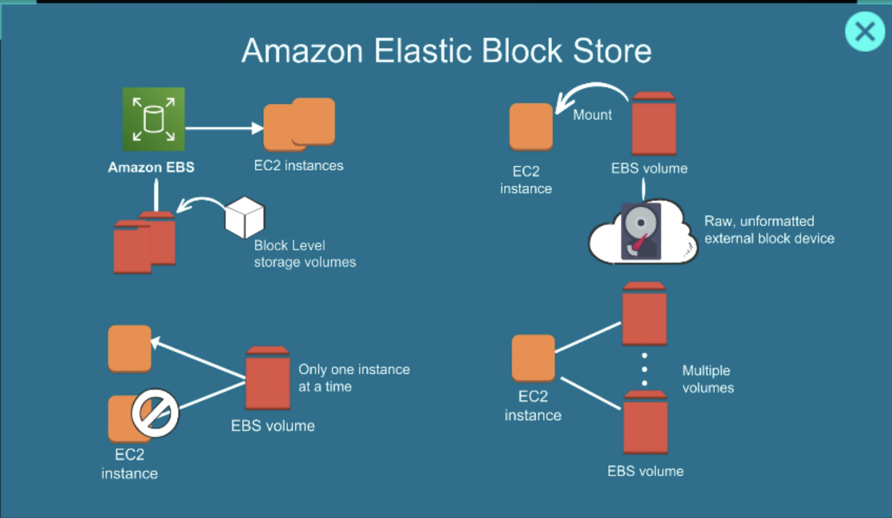

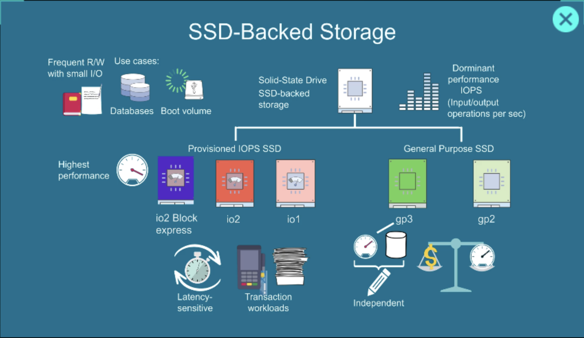


#### Security Groups

A firewall for EC2.

Example rules:

| Port | Purpose |
| ---- | ------- |
| 22   | SSH     |
| 80   | HTTP    |
| 443  | HTTPS   |
| 8000 | FastAPI |

If port 8000 isn't allowed, your FastAPI app won't be reachable.


#### Key Pair

Used for SSH access.

Example:

```bash
ssh -i mykey.pem ubuntu@<public-ip>
```

Keep the `.pem` file safe.


### Launch Flow

```text
AMI
 ↓
Instance Type
 ↓
Storage (EBS)
 ↓
Security Group
 ↓
Key Pair
 ↓
Launch EC2
```

---

### Example: Deploy FastAPI

1. Launch Ubuntu EC2
2. Open ports:

   * 22
   * 80
   * 443
3. SSH into server

```bash
ssh -i key.pem ubuntu@server-ip
```

4. Install Python

```bash
sudo apt update
sudo apt install python3-pip
```

5. Run FastAPI

```bash
uvicorn app:app --host 0.0.0.0 --port 8000
```

6. Access from browser

```text
http://server-ip:8000/docs
```

---

### Public IP vs Private IP

| Type       | Accessible From |
| ---------- | --------------- |
| Public IP  | Internet        |
| Private IP | Inside VPC      |

Example:

* Public: `13.x.x.x`
* Private: `172.31.x.x`

---

### EC2 Pricing Models

#### On-Demand

Pay as you use.

Best for:

* Development
* Testing

#### Reserved Instances

Commit for 1–3 years.

Best for:

* Predictable workloads

#### Spot Instances

Use spare AWS capacity.

Can be terminated anytime.

Best for:

* Batch jobs
* CI/CD

---

### Important EC2 Concepts

* Start Instance
* Stop Instance
* Reboot Instance
* Terminate Instance (deletes the server)
* Create AMI (server backup)
* Attach IAM Role
* Attach EBS Volume

---

### Real-world Architecture

For a FastAPI application:

```text
Users
   ↓
Load Balancer
   ↓
EC2 (FastAPI)
   ↓
RDS (PostgreSQL)
   ↓
S3 (Files/Images)
```

# AWS DNS: Domain Name System

DNS is a system, that translate human readable english domain name to a fixed IP, for server commnunication.


